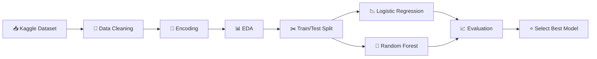

#  Obesity Prediction Baseline

<p align="center">
  
  
  
  
  
</p>

> Dự án xây dựng mô hình dự đoán mức độ béo phì dựa trên dữ liệu về cơ địa, thói quen ăn uống, sinh hoạt và tiền sử gia đình.  
> Trọng tâm của dự án là **ứng dụng các công nghệ Data Science và Machine Learning có sẵn** để xử lý dữ liệu, phân tích và so sánh mô hình.

---

## 👥 Thành viên và Đóng góp

| MSV | Thành viên  | Đóng góp (%) |
|---|---|---|
| 24021420 | **Bạch Công Dũng**  | 40 |
| 24021372 | **Nguyễn Văn Hoàng Anh** | 30 |
| 24021396 | **Đặng Danh Công** | 30 |

---

## 🎯 Mục tiêu dự án

Dự án trả lời câu hỏi:

> **Có thể dự đoán mức độ béo phì của một người dựa trên thói quen ăn uống, sinh hoạt và yếu tố gia đình không?**

Các mục tiêu chính:

- Khai thác bộ dữ liệu về béo phì từ Kaggle.
- Tiền xử lý và mã hóa dữ liệu để đưa vào mô hình Machine Learning có sẵn.
- Phân tích khám phá dữ liệu để tìm các xu hướng đáng chú ý.
- Sử dụng và so sánh hai mô hình:
  - Logistic Regression
  - Random Forest
- Chọn mô hình phù hợp nhất dựa trên kết quả đánh giá.

---

## 🗂️ Nguồn dữ liệu sử dụng

### 1. Kaggle Playground Series - Season 4, Episode 2

Dữ liệu chính của dự án lấy từ cuộc thi:

**Multi-Class Prediction of Obesity Risk**  
Kaggle Playground Series - Season 4, Episode 2

Đây là bộ dữ liệu dùng cho bài toán phân loại nhiều lớp nhằm dự đoán mức độ béo phì.

Link nguồn:

```text
https://www.kaggle.com/competitions/playground-series-s4e2
```

### 2. Bộ dữ liệu gốc từ UCI Machine Learning Repository

Bộ dữ liệu Kaggle được tạo dựa trên bộ dữ liệu gốc:

**Estimation of Obesity Levels Based On Eating Habits and Physical Condition**

Nguồn gốc dữ liệu gốc:

- Khu vực: Mexico, Peru và Colombia
- Số bản ghi gốc: 2,111
- Số thuộc tính gốc: 17
- Biến mục tiêu: mức độ béo phì

Link nguồn:

```text
https://archive.ics.uci.edu/dataset/544/estimation+of+obesity+levels+based+on+eating+habits+and+physical+condition
```

### 3. Tài liệu tham khảo y tế

Dự án có tham khảo thông tin nền về béo phì từ WHO.

Link nguồn:

```text
https://www.who.int/news-room/fact-sheets/detail/obesity-and-overweight
```

---

## 🛠️ Công nghệ sử dụng

| Công nghệ / Thư viện | Vai trò trong dự án |
|---|---|
| **Python** | Ngôn ngữ lập trình chính |
| **Jupyter Notebook** | Môi trường viết code, chạy thử nghiệm và trình bày kết quả |
| **Pandas** | Đọc dữ liệu, xử lý bảng dữ liệu, kiểm tra missing values |
| **NumPy** | Hỗ trợ tính toán số học |
| **Matplotlib** | Vẽ biểu đồ cơ bản |
| **Seaborn** | Trực quan hóa dữ liệu nâng cao |
| **SciPy** | Thực hiện kiểm định thống kê, ví dụ Chi-square test |
| **scikit-learn** | Xây dựng, huấn luyện và đánh giá mô hình Machine Learning |

---

## 🤖 Mô hình Machine Learning sử dụng

Trong dự án này, nhóm **không tự viết thuật toán Logistic Regression và Random Forest từ đầu**.  
Thay vào đó, nhóm sử dụng các mô hình có sẵn trong thư viện **scikit-learn**, đây là cách làm phổ biến trong các dự án Machine Learning thực tế.

### 1. Logistic Regression

Nguồn sử dụng:

```python
from sklearn.linear_model import LogisticRegression
```

Cách khởi tạo trong dự án:

```python
lr_model = LogisticRegression(max_iter=3000, random_state=42)
```

Vai trò:

- Là mô hình baseline.
- Dùng để kiểm tra hiệu quả ban đầu.
- Phù hợp với bài toán phân loại, nhưng còn hạn chế khi dữ liệu có quan hệ phi tuyến.

Kết quả trong dự án:

```text
Accuracy: khoảng 61% - 64%
```

Nhận xét:

- Mô hình đơn giản, dễ giải thích.
- Tuy nhiên dễ nhầm lẫn giữa các nhóm thể trạng gần nhau.
- Có xuất hiện cảnh báo hội tụ, nên nên chuẩn hóa dữ liệu nếu cải tiến tiếp.

Tài liệu scikit-learn:

```text
https://scikit-learn.org/stable/modules/generated/sklearn.linear_model.LogisticRegression.html
```

---

### 2. Random Forest Classifier

Nguồn sử dụng:

```python
from sklearn.ensemble import RandomForestClassifier
```

Cách khởi tạo trong dự án:

```python
rf_clf = RandomForestClassifier(n_estimators=100, random_state=42)
```

Vai trò:

- Là mô hình chính được lựa chọn.
- Dùng 100 cây quyết định để đưa ra dự đoán cuối cùng.
- Phù hợp hơn với dữ liệu có quan hệ phi tuyến giữa các đặc trưng sức khỏe.

Kết quả trong dự án:

```text
Accuracy: khoảng 89% - 90%
```

Nhận xét:

- Hiệu quả cao hơn Logistic Regression rõ rệt.
- Phân loại tốt hơn các nhóm béo phì nặng.
- Giảm nhầm lẫn giữa các lớp liền kề.
- Được chọn làm mô hình cuối cùng của dự án.

Tài liệu scikit-learn:

```text
https://scikit-learn.org/stable/modules/generated/sklearn.ensemble.RandomForestClassifier.html
```

---

## 📦 Các hàm và công cụ chính từ scikit-learn

| Thành phần | Cách dùng | Vai trò |
|---|---|---|
| `train_test_split` | `sklearn.model_selection` | Chia dữ liệu thành tập train/test |
| `LabelEncoder` | `sklearn.preprocessing` | Mã hóa biến dạng chữ thành số |
| `LogisticRegression` | `sklearn.linear_model` | Huấn luyện mô hình Logistic Regression |
| `RandomForestClassifier` | `sklearn.ensemble` | Huấn luyện mô hình Random Forest |
| `accuracy_score` | `sklearn.metrics` | Tính độ chính xác |
| `classification_report` | `sklearn.metrics` | Đánh giá Precision, Recall, F1-score |
| `confusion_matrix` | `sklearn.metrics` | Phân tích ma trận nhầm lẫn |

---

## 🔄 Quy trình xử lý và mô hình hóa



Các bước chính:

1. **Đọc dữ liệu**
   - Sử dụng `pandas.read_csv()`.
   - Kiểm tra số dòng, số cột và kiểu dữ liệu.

2. **Kiểm tra dữ liệu thiếu**
   - Dùng `df.isnull().sum()`.
   - Kết quả: dữ liệu không có missing values.

3. **Mã hóa dữ liệu**
   - Dùng `pd.get_dummies()` cho một số biến phân loại.
   - Dùng `LabelEncoder()` cho biến nhãn hoặc biến dạng chữ.

4. **Chia tập dữ liệu**
   - Dùng `train_test_split()`.
   - Tỷ lệ: 80% train, 20% test.
   - `random_state=42` để kết quả có thể tái lập.

5. **Huấn luyện mô hình**
   - Logistic Regression làm mô hình baseline.
   - Random Forest làm mô hình chính.

6. **Đánh giá mô hình**
   - Accuracy Score.
   - Classification Report.
   - Confusion Matrix.

---

## 📊 Kết quả mô hình

| Mô hình | Công nghệ sử dụng | Accuracy | Nhận xét |
|---|---|---:|---|
| Logistic Regression | `sklearn.linear_model.LogisticRegression` | ~61% - 64% | Mô hình baseline, đơn giản nhưng chưa xử lý tốt quan hệ phi tuyến |
| Random Forest | `sklearn.ensemble.RandomForestClassifier` | ~89% - 90% | Mô hình tốt hơn, phù hợp với dữ liệu phức tạp |

### Mô hình được chọn

> **Random Forest Classifier** được chọn làm mô hình cuối cùng vì đạt độ chính xác cao hơn và xử lý tốt hơn các mối quan hệ phi tuyến giữa cơ địa, dinh dưỡng, sinh hoạt và yếu tố gia đình.


---

## 🚀 Cách chạy dự án

### 1. Cài đặt thư viện

```bash
pip install pandas numpy matplotlib seaborn scikit-learn scipy
```

### 2. Mở notebook

```bash
jupyter notebook obesity-prediction-baseline.ipynb
```

Hoặc có thể chạy bằng:

- Google Colab
- Kaggle Notebook
- JupyterLab
- VS Code

### 3. Chạy toàn bộ các cell

Nên chạy notebook từ trên xuống dưới để đảm bảo các biến và mô hình được cập nhật đúng thứ tự.

---

## ⚠️ Lưu ý kỹ thuật

Một số điểm cần chú ý nếu tiếp tục cải thiện dự án:

- Cột `id` không nên dùng làm đặc trưng dự đoán vì chỉ là mã định danh.
- Logistic Regression nên kết hợp với chuẩn hóa dữ liệu để tránh lỗi hội tụ.
- Nên thống nhất một pipeline xử lý dữ liệu để tránh ghi đè biến.
- Nên dùng `stratify=y` khi chia train/test để giữ tỷ lệ các lớp.
- Có thể dùng Cross-validation để đánh giá ổn định hơn.
- Có thể dùng GridSearchCV hoặc RandomizedSearchCV để tối ưu siêu tham số.

---

## 🔮 Hướng phát triển

Dự án có thể mở rộng theo các hướng:

- Thêm bước chuẩn hóa bằng `StandardScaler`.
- Sử dụng `Pipeline` của scikit-learn.
- Tối ưu Random Forest bằng Grid Search.
- Thử thêm các mô hình mạnh hơn:
  - XGBoost
  - LightGBM
  - CatBoost
- Phân tích Feature Importance để giải thích yếu tố nào ảnh hưởng mạnh nhất.
- Xuất mô hình đã huấn luyện bằng `joblib` hoặc `pickle`.

---

## 📚 Nguồn tham khảo

1. Kaggle - Multi-Class Prediction of Obesity Risk  
   https://www.kaggle.com/competitions/playground-series-s4e2

2. Kaggle Data Description  
   https://www.kaggle.com/competitions/playground-series-s4e2/data

3. UCI Machine Learning Repository - Estimation of Obesity Levels Based On Eating Habits and Physical Condition  
   https://archive.ics.uci.edu/dataset/544/estimation+of+obesity+levels+based+on+eating+habits+and+physical+condition

4. scikit-learn Documentation  
   https://scikit-learn.org/stable/

5. scikit-learn LogisticRegression  
   https://scikit-learn.org/stable/modules/generated/sklearn.linear_model.LogisticRegression.html

6. scikit-learn RandomForestClassifier  
   https://scikit-learn.org/stable/modules/generated/sklearn.ensemble.RandomForestClassifier.html

7. WHO - Obesity and overweight  
   https://www.who.int/news-room/fact-sheets/detail/obesity-and-overweight

---

## ✅ Kết luận

Dự án sử dụng các công nghệ phổ biến trong Data Science như **Python, Pandas, Seaborn, SciPy và scikit-learn** để xây dựng bài toán dự đoán mức độ béo phì.

Hai mô hình chính, **Logistic Regression** và **Random Forest**, đều được lấy từ thư viện scikit-learn, giúp nhóm tập trung vào các bước quan trọng hơn như xử lý dữ liệu, phân tích, huấn luyện, đánh giá và giải thích kết quả.

Kết quả cho thấy **Random Forest** là mô hình phù hợp hơn trong dự án này vì đạt độ chính xác cao hơn và xử lý tốt hơn các quan hệ phi tuyến trong dữ liệu.
